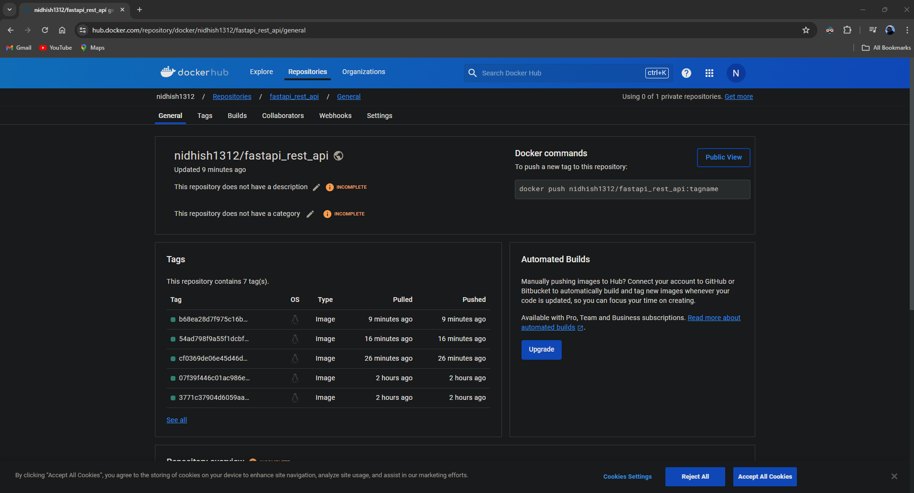

# Homework 10

## Project Setup

### 1. Testing the Application

The project's test cases are configured and run successfully with no failures.

### 2. FastAPI Setup

FastAPI is configured according to the guide and is running as expected.

### 3. Database Setup

The PostgreSQL database is created and can be accessed through PGAdmin.

## Issues Link

- [Issue 1](https://github.com/NidhishVyas/event_manager/pull/1): Solved the issue of data mismatch when logging in
- [Issue 2](https://github.com/NidhishVyas/event_manager/pull/2): Updated user schemas with improved bio and profile picture
- [Issue 3](https://github.com/NidhishVyas/event_manager/pull/3): Updated status code in create user route to 200 OK
- [Issue 4](https://github.com/NidhishVyas/event_manager/pull/4): Validation check on email
- [Issue 5](https://github.com/NidhishVyas/event_manager/pull/5): Implemented password hashing and verification
- [Issue 6](https://github.com/NidhishVyas/event_manager/pull/6): Normalize username so that there is consistent usernames
- [Issue 7](https://github.com/NidhishVyas/event_manager/pull/7): Validation for username length to be more than 5 characters

## Docker Configuration

A Docker image of the project setup is created and can be viewed below:

## Pytest Coverage

Increased the pytest coverage to 90%:

## Conclusion

I encountered numerous challenges during my "Event Manager" assignment, particularly while debugging complex code, which was like solving a complex puzzle. Correcting one error often clarified the solution to the next. Collaborating on multiple project branches required effective communication and meticulous planning. Utilizing Git for version control and GitHub for tracking and reviews significantly improved my organizational skills. This project not only refined my technical skills with Docker, pytest, and REST APIs but also enhanced my problem-solving abilities. It was a profound learning experience that expanded my technical expertise and prepared me for future challenges in the software development field.
